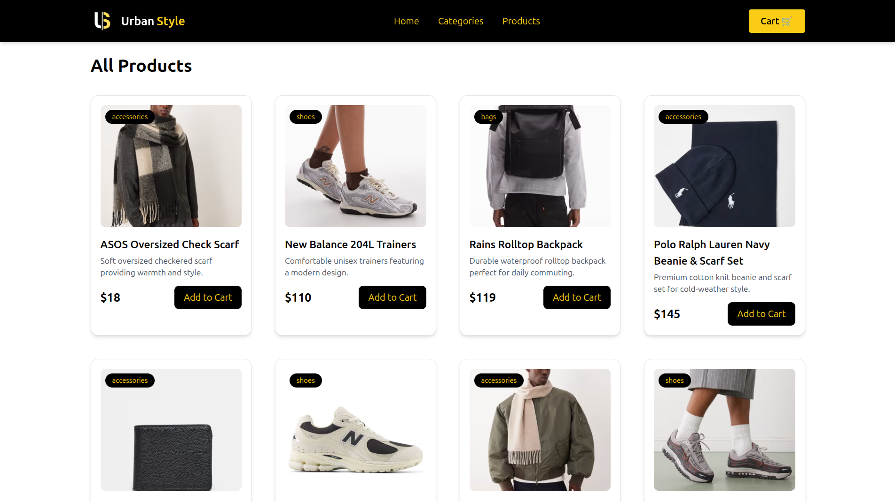

# 🛍️ UrbanStyle — Full-Stack E-Commerce Web App

A modern, fully responsive e-commerce web application built with **React (Vite)** on the frontend and **Node.js + Express + MongoDB Atlas** on the backend.  
UrbanStyle provides category-based browsing, detailed product views, a full cart system, and a clean user experience — all deployed on **AWS EC2** with **Nginx** and a **custom domain**.

---



---

## ✨ Features

- **🛒 Full Cart System** — Add, update, remove items with real-time UI updates  
- **📦 MongoDB Product Storage** — All products served via a custom REST API  
- **🔍 Category-Based Browsing** — Filter and explore products effortlessly  
- **📱 Fully Responsive UI** — Optimized layout for mobile and desktop  
- **🏷️ Single Product Pages** — Dynamic, data-driven product detail view  
- **🚀 Deployed on AWS EC2** — Nginx reverse proxy + PM2 process manager  
- **🌐 Custom Domain Support** — Live on a dedicated subdomain  

---

## 🧠 Tech Stack

### Frontend
- React (Vite)  
- Tailwind CSS  
- React Router  

### Backend
- Node.js  
- Express  
- MongoDB Atlas  
- Mongoose  

### Deployment / DevOps
- AWS EC2  
- Nginx Reverse Proxy  
- PM2  
- Git & GitHub  

---

## 📁 Folder Structure

urban-style-e-commerce-web-app/
│
├── client/ # React frontend
│ ├── src/
│ └── dist/ # Production build
│
└── server/ # Backend API
├── routes/
├── controllers/
├── config/
└── server.js

---

## 🚀 Installation & Setup (Local Development)

### 1️⃣ Clone the repository
```
git clone https://github.com/YOUR_USERNAME/urban-style-e-commerce-web-app.git
cd urban-style-e-commerce-web-app
```

2️⃣ Backend Setup
```
cd server
npm install
```

Create .env:
```
MONGO_URI=your_mongodb_connection
PORT=5000
```

Start server:
```
node server.js
```

3️⃣ Frontend Setup
```
cd ../client
npm install
npm run dev
```
```
Frontend: http://localhost:5173

Backend: http://localhost:5000/api/products
```
🚀 Production Deployment (AWS EC2)

SSH into EC2

Clone project

Build frontend:
```
cd client
npm run build
```

Start backend with PM2:
```
cd ../server
pm2 start server.js
```

Configure Nginx (proxy + static hosting)

Restart Nginx:
```
sudo systemctl restart nginx
```

Your app goes live on your custom subdomain.

🧪 API Endpoints
Get All Products
GET /api/products

Get Single Product
GET /api/products/:id

Add Product
POST /api/products

📌 Future Improvements

User authentication (JWT)

Admin dashboard for product management

Stripe payment integration

Wishlist system

Reviews & ratings

❤️ Acknowledgements

This project showcases real-world full-stack development, covering UI design, backend architecture, database modeling, deployment pipelines, and production hosting.
